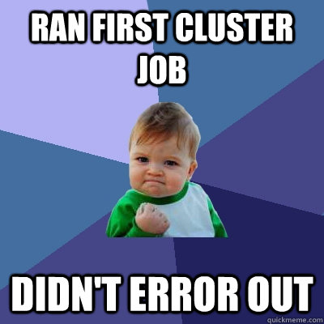
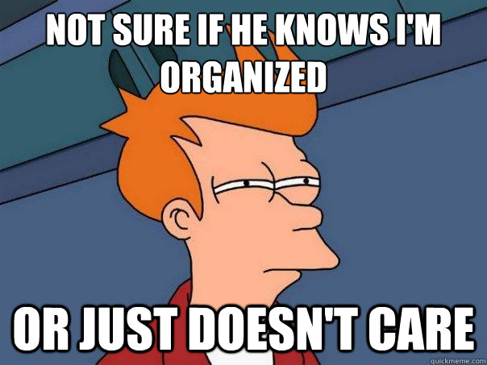

## I love grad school let me jump right in!

* First off, calm down.
    * You can't learn everything at once.

* We all learned by asking others
    * Don't worry, someday it'll be you on the other end

--- .class #id 

## Where to Start

* Go to here http://www.gradhacker.org/2013/08/29/4781/
    * General tips for grad school
* Get LaTeX (already noted)
* Get a Text Editor - with text highlighting 

   * You will get .txt, .csv, .rtf, .html - just have one you like
   * Preferably something that works with the cluster
   * Notepad++
   * Sublime Text 2
   * TextWrangler
   * Emacs, vim, gedit (old school stuff, but works with cluster)

---

## Tools for stuff - reproducibility

* `Sweave` - http://www.stat.uni-muenchen.de/~leisch/Sweave/
     * Allows for reproducible code (LaTeX and R together)
     * Beamer allows for ppt-like presentations
* `knitr` http://yihui.name/knitr/ - Sweave upgrade 
    * Duke Scandal - non reproducible
    * http://www.nytimes.com/2011/07/08/health/research/08genes.html?_r=0
    * RStudio has a button for this - so you know it's good
* `slidify` - make presentations as cool as this one (or try) http://slidify.org/
    * Allows you to make knitted presentations

---

## Tools for stuff

* `git`  http://git-scm.com/downloads
    * Ever forget to save a Word Doc - try that with 1000 lines of code
    * Versioning software that allows you to revert to old copies
    * See differences over time 
    * SourceTree allows you to visualize the trajectory
* `pandoc` - http://johnmacfarlane.net/pandoc/ 
    * "Can you save that in Word, I hate PDFs" 
    * Allows conversion to a lot of different formats for your .tex/.md, etc.

---

## Why do I need these things?

You may say to yourself 2 things
* I backup my stuff I don't need `git` 
* I'm super organized with folders and naming conventions, I don't need `knitr` or `Sweave`, I can find my plots/analysis/results 

---

## But really...

You are a liar, or just sadly mistaken.

* Git is not the only answer, but have a backup and really consider version control and naming conventions at a minimum
* Even the best naming conventions won't save you
    * What happens if the file is deleted (Dropbox is not really an answer)
    * Analysis_V1 is horrible, Logistic_Models_2013Sep09 is better, but not great
* Methods = Software and Software = Version control (Git)
* Folder organization is good, but do you make a folder for every sub-analysis
    * Gets complicated fast

---

## Real quick `git`

* Download and Install `git` http://git-scm.com/downloads
* Sign up for https://bitbucket.org/ and https://github.com/
* You set up a repository `git init`
* You add files to it `git add .` (the . is intentional - saying all files)
* You commit that to a repository ALWAYS with a comment (still local) `git commit -m "Comments are delicious"`
* (Optional) You push to a web repository `git push origin master`
    * For this you need to have `git remote add https://github.com/user/repo.git`
* brainR example https://github.com/muschellij2/brainR

---

## Don't re-invent the wheel

* Leonardo Collado Torres made a great slide deck last year
* https://bitbucket.org/lcolladotor/html_git_intro/src/1d72a21b1b7ed4421da165bd2f9d377a5f7f0f4b/slides/html_git.pdf?at=master
* Also - set up a website.

## Learn the Term

* Terminal will become your best friend
* You can do things faster (and scriptable) by doing things in the terminal
* Life will be easier on the cluster

* blah blah

